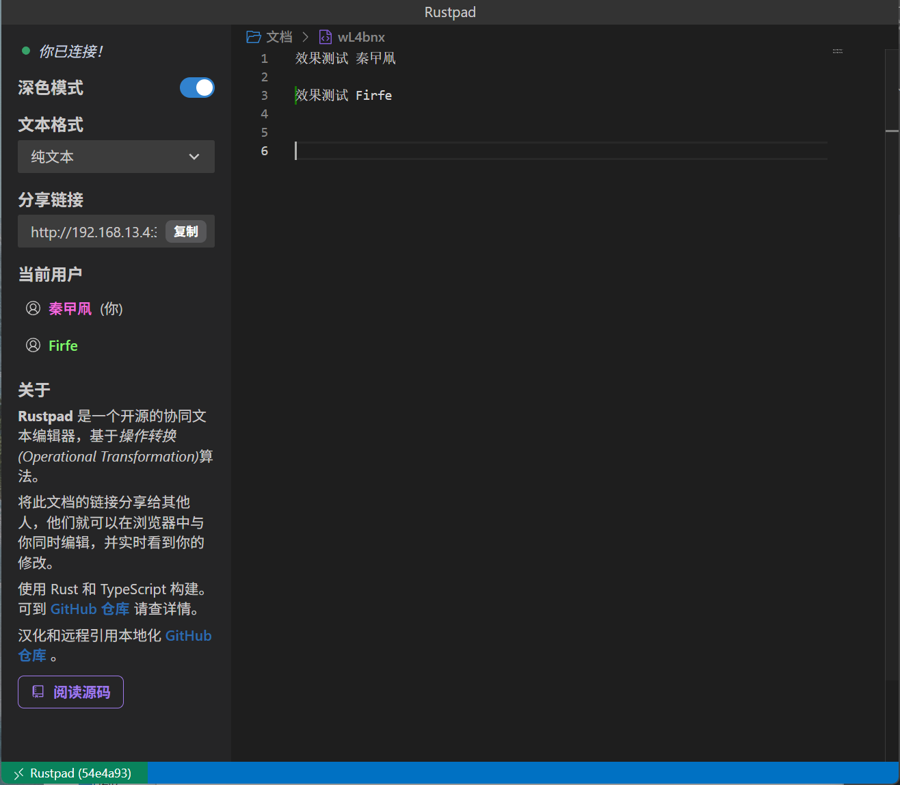

# rustpad 前端

汉化，取消远程引用，使用本地文件，左侧块减少宽度。

修改的不是源码，我在本地按照原项目的Dockerfile文件构建失败了，所以修改的是Docker镜像中复制出来的文件。

当前修改仅适用2025.05.06之前的镜像

首先感谢原作者的开源。[原项目地址](https://github.com/ekzhang/rustpad)

具体修改了那些内容，请参考[翻译修改说明](./翻译修改说明.md)。

只做了汉化和简单修改，有问题，请到原作者仓库处反馈。

有需要帮忙部署这个项目的朋友,一杯奶茶,即可程远程帮你部署，需要可联系。  
微信号 `E-0_0-`  
闲鱼搜索用户 `明月人间`  
或者邮箱 `firfe163@163.com`  
如果这个项目有帮到你。欢迎start。

有其他的项目的汉化需求，欢迎提issue。或其他方式联系通知。

### 镜像

从阿里云或华为云镜像仓库拉取镜像，注意填写镜像标签，镜像仓库中没有`latest`标签

容器内部端口 3030

```bash
docker pull swr.cn-north-4.myhuaweicloud.com/firfe/rustpad:2025.05.06
```
## 部署

直接下载本仓库，将`dist`目录挂载到原项目容器中的`/dist`中。  
注意文件权限，将所有者设置`1000:1000`或者直接修改权限为`777`.

或者使用下面我提供的镜像

### docker run 命令部署

``bash
docker run -d \
--name rustpad \
--network bridge \
--restart always \
--log-opt max-size=1m \
--log-opt max-file=3 \
-p 端口:3030 \
wr.cn-north-4.myhuaweicloud.com/firfe/rustpad:2025.05.06
``
### compose 文件部署 👍推荐

``yaml
#version: '3.9'
services:
  rustpad:
    container_name: rustpad
    image: wr.cn-north-4.myhuaweicloud.com/firfe/rustpad:2025.05.06
    network_mode: bridge
    restart: always
    logging:
      options:
        max-size: 1m
        max-file: '3'
    ports:
      - 端口:3030
``

## 效果截图




